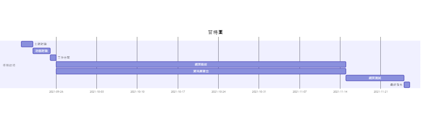
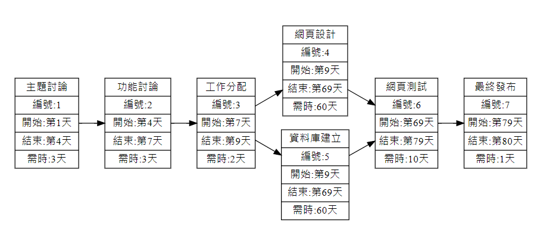
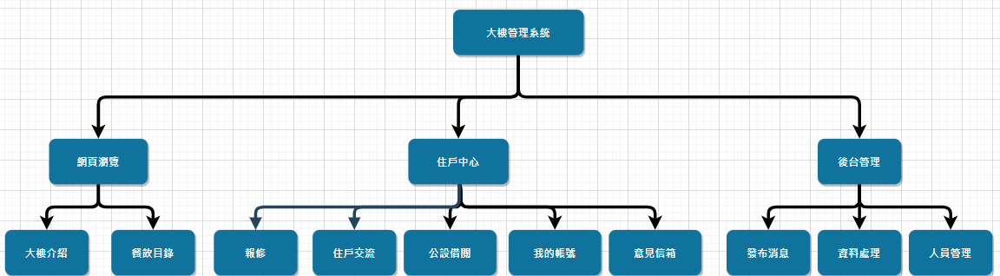
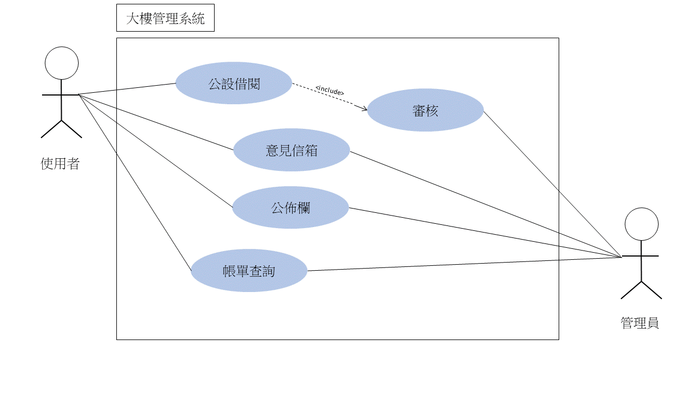
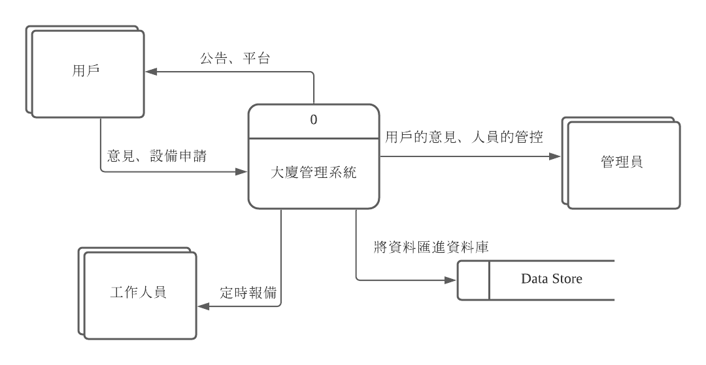
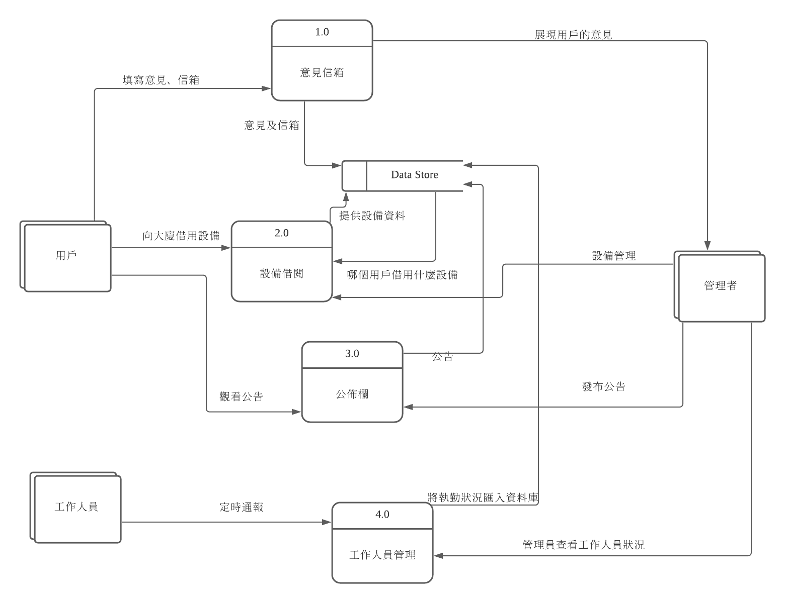
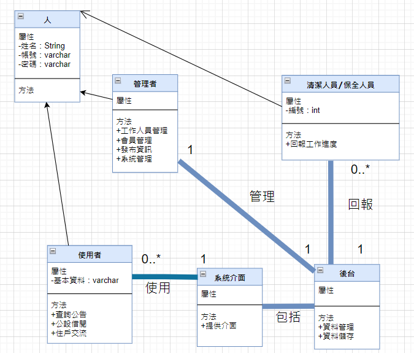
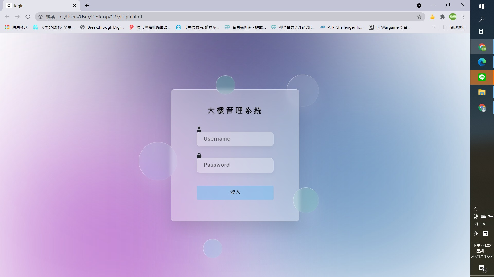
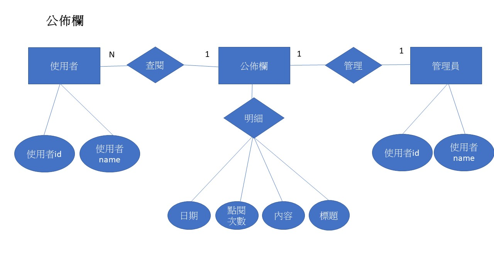
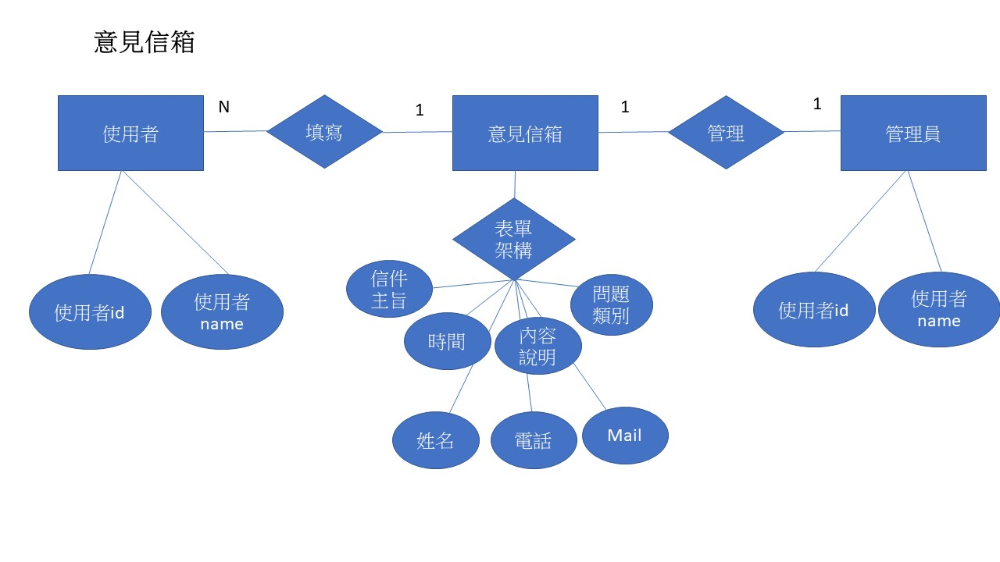

# 期末報告
[期末報告ppt](https://docs.google.com/presentation/d/1u9ToqontEYOgsU47jiOWDi7Dej599pV5CsbxASHGfO8/edit#slide=id.g10b496824d5_0_169)

[期末demo程式碼](https://github.com/weishan523/123.git)

# 題目：大廈管理系統
### 組長：C108118128 林漢瑄
### 組員：C108118121 吳瑋珊
### 組員：C108118104 李俍潣

# 工作分配
系統&資料庫：林漢瑄

網頁前端：吳瑋珊

美工＆文件：李俍潣

# 內容
因應疫情可以做到無接觸，將大廈的管理智慧化，方便管理人員，也方便使用者

# 甘特圖

# PERT/CPM圖

# 功能性需求
* 公佈欄
* 公設借閱
* 帳單查詢

# 非功能性需求
* 網頁相容性
* 便利
* 效能

# 功能分解圖(FDD)

# 需求分析
大廈管理系統的需求分析：
1. 管理者可利用後台做公告的發布、意見的管理、設備的管理及人員的管控。
2. 使用者可透過網頁觀看公告、提出意見以及帳單的查詢。
3. 後台可即時通報管理員，使用者的報修情形。
4. 後台可即時的反應保全及清潔人員的工作進度。

# 使用案例圖

# 使用案例說明
|使用案例名稱|意見信箱|
|:---|:---|
|行動者|用戶|
|說明|用戶投訴/提出意見的方式|
|完成動作|1. 登入此系統 2. 進入系統的意見信箱欄位 3. 填寫意見及信箱 4. 送出成功|
|替代方案|1. 登入此系統 2. 進入系統的意見信箱欄位 3. 填寫意見及信箱 4. 信箱填寫錯誤|
|先決條件|開啟大廈管理系統的網頁|
|後置條件|後台要將這筆意見放入資料庫中|
|假設|無|

|使用案例名稱|公設借閱|
|:---|:---|
|行動者|用戶|
|說明|用戶借用公共設備的方法|
|完成動作|1. 登入此系統 2. 進入系統的公設借閱欄位 3. 填寫要借的物品及借用者 4. 借閱成功並有物品位置顯示|
|替代方案|1. 登入此系統 2. 進入系統的公設借閱欄位 3. 填寫要借的物品及借用者 4. 借用者或物品有填寫錯誤|
|先決條件|開啟大廈管理系統的網頁|
|後置條件|後台要記錄誰使用了什麼|
|假設|無|

|使用案例名稱|帳單查詢|
|:---|:---|
|行動者|用戶|
|說明|用戶查詢自己的帳單|
|完成動作|1. 登入此系統 2. 進入系統的帳單查詢欄位 3. 顯示該用戶的帳單|
|替代方案|1. 登入此系統 2. 進入系統的帳單查詢欄位 3. 顯示該用戶無帳單可查詢|
|先決條件|開啟大廈管理系統的網頁|
|後置條件|無|
|假設|無|

# 系統環境圖(DFD)

# DFD 圖0

# UML 類別圖(class Diagram)

# 循序圖
意見信箱.jpg "循序圖(一)意見信箱")
公設借閱.jpg "循序圖(二)公設借閱")
帳單查詢.jpg "循序圖(三)帳單查詢")

# 活動圖
意見信箱")
公設借閱")
帳單查詢")

# 分鏡板
登入畫面

主畫面

# 實體關係圖(entity-relationship diagram, ERD)
公佈欄

意見信箱

