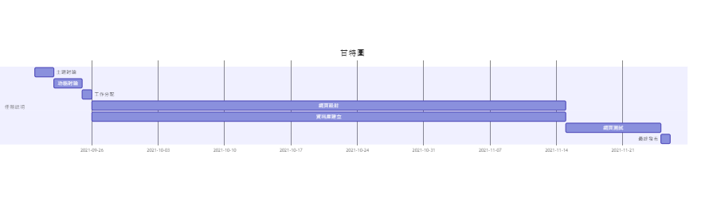
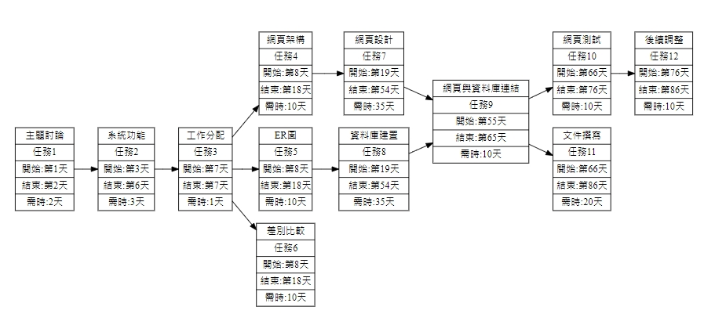

# 題目：大廈管理系統
### 組長：C108118128 林漢瑄
### 組員：C108118121 吳瑋珊
### 組員：C108118104 李俍潣

# 工作分配
系統&資料庫：林漢瑄

網頁前端：吳瑋珊

美工＆文件：李俍潣

# 內容
因應疫情可以做到無接觸，將大廈的管理智慧化，方便管理人員，也方便使用者

# 甘特圖

# PERT/CPM圖

# 功能性需求
* 

# 非功能性需求

# 功能分解圖(FDD)

# 需求分析

# 使用案例圖

# 使用案例說明(三個以上)
